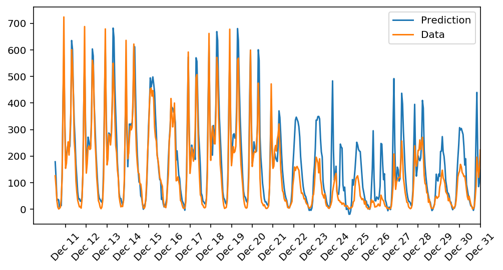

# Bike_Sharing--Udacity_Deep_Learning-Nanodegree
The 1st project of the Deep Learning Nanodegree.

In this project the aim was to build a neural network from scratch that would be able to predict the bike-sharing demand over time for a year given similar data. The data presented was absolutely structured. The neural network was built using the Scipy stack (numpy). It was a shallow network with configurable number of nodes in the layer and other hyperparameters. The network was able to identify the most prevalent patterns and achieve an excellent prediction score. Below we can see the performance of this simple model.

